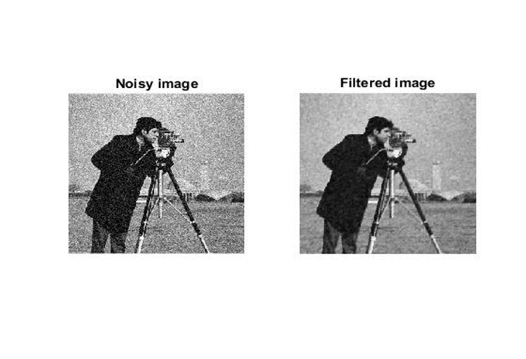

## Objective

The project focuses on learning optimized Partial Differential Equation (PDE) models for image filtering. Using training techniques, we optimize parameters of a nonlinear diffusion model for image denoising. We further improve the output with efficient backpropagation techniques. The PDE model for noise removal involves parameters like noise level, threshold for distinguishing noise and edges, and diffusion function. Our primary aim is to learn these parameters using deep learning techniques like backpropagation and incorporate them into the PDE model to obtain a higher quality filtered image. We suggest transforming a PDE based on a nonlinear cross-diffusion process into a learnable structure to optimize the model parameters while ensuring stability throughout the learning process.

## Methodology


Two denoising models were employed in the project, with the linear model applied first, followed by the non-linear Perona-Malik model. The performance results on the test image were compared, guiding the project to the next phase of the analysis. Subsequently, a learning model based on nonlinear cross-diffusion was introduced and transformed into a trainable architecture using backpropagation techniques. This optimization process resulted in enhanced denoising and deblurring performance while ensuring stability throughout the learning procedure. The trainable non-linear reaction diffusion (TNRD) model was implemented to adaptively switch between image smoothing and sharpening. Parameter refinement employed both greedy and joint training schemes, and the optimization of the filter size achieved a balance between computational efficiency and model performance.


## Linear Model
write here


## Prerona-Malik Model
We use heat equation for filtering the images
Certainly! Here's a refined explanation of the algorithm for this model:

Let's denote the current value of a point in the matrix U as U(i, j). The algorithm updates the value of each point in the matrix based on its neighboring points. The update is done using the following formula:

\[ U = U + r \cdot (U_{\text{up}} + U_{\text{down}} + U_{\text{left}} + U_{\text{right}} - 4 \cdot U) \]

Here's what each term represents:

- \( U_{\text{up}} \): The value at the point above the current point (shifts down).
- \( U_{\text{down}} \): The value at the point below the current point (shifts up).
- \( U_{\text{left}} \): The value at the point to the left of the current point (shifts right).
- \( U_{\text{right}} \): The value at the point to the right of the current point (shifts left).
- \( r \): A constant factor that influences the update.

In simpler terms, each point in the matrix is updated by taking into account the values of its neighboring points. The update is a weighted sum of the differences between the current point and its neighbors, with the weight determined by the constant factor \( r \). This process helps evolve the values of the matrix over iterations.




## Learning Model
- We propose to take a PDE based on a nonlinear cross-diffusion process and turn it into a learnable architecture in order to optimize the parameters of the model. In particular, we use a back-propagation technique in order to minimize a cost function related to the quality of the denoising and de blurring  process, while we ensure stability during the learning procedure.
- This model reads a ground-truth image, degrades the image by first blurring or downscaling it, followed by an addition of random white Gaussian noise. Then it calls to RED in order to restore the image.  This  compares the input and output PSNR, shows and saves the  results. The suggested image-adaptive Laplacian-regularization functional  is minimized using the Steepest Descent methods.
- The following are the degradation models that this model handles:        'Uniform Blur'  'Gaussian Blur'  'Downscale
- So, to introduce our model into learning frame work we should firstly prepare the input/output pairs for a certain image processing task, and then exploit a loss minimization scheme to learn the model parameters Θt for each stage t of the diffusion process. We use training scheme joint training this minimizes problem with respect to the parameters in all stages. we also use greedy training scheme to pre-train our diffusion network stage-by-stage and to minimize the cost function
- Our trained diffusion model can lead to explicit backward diffusion process, which sharpens image structures like edges and also can adaptively switch  image smoothing (forward diffusion)  which leads to an adaptive forward-and-backward diffusion process. 

## TRAINABLE NON-LINEAR REACTION DIFFUSION (TNRD) Model
- Truncated concave functions with smaller values at the two tails this is a penalty function with a concave shape, This penalty function also encourages to sharpen the image edges. Concerning the learned penalty function 
- We train the proposed diffusion network and observe its saturation behavior after certain stages We first greedily train T stages of our model with specific model capacity, then conduct a joint training to refine the parameters of the whole T stages.
- In our model, the size of involved filters is a free parameter. In principle, we can exploit filters of any size, but in practice, we need to consider the trade-off between run time and accuracy. 
- We increase the filter size to 7×7 and 9×9. We find that increasing the filter size from 5 × 5 to 7 × 7 brings a significant improvement of 0.14dB ( TNRD5 7×7 vs.TNRD5 5×5 ) . However, when we further increase the filter size to 9 × 9, the resulting TNRD5 9×9 only leads to a performance of 28.96dB (a slight improvement of 0.05dB relative to the TNRD5 7×7 model). We can conjecture that further increasing the filter size to 11 × 11 might bring negligible improvements. In practice, we prefer the TNRD5 7×7 model as it provides the best trade-off between performance and computation time.

### Result of TNRD Model
 


-------------------------------------------------
## About RED: version 1.0.0

Demonstration of the image restoration experiments conducted in 
Y. Romano, M. Elad, and P. Milanfar, "[The Little Engine that Could: 
Regularization by Denoising (RED)](https://epubs.siam.org/doi/10.1137/16M1102884)", 
SIAM Journal on Imaging Sciences, 10(4), 1804–1844, 2017 
[[arXiv](https://arxiv.org/abs/1611.02862)].


The code was tested on Windows 7 and Windows 10, with Matlab R2016a.
This is not an official Google product.

### Quick start

1. Clone or download this repository.
2. Download a lightweight version of TNRD denoising from
   https://drive.google.com/file/d/0B9L0NyTobx_3NHdJLUtPQWJmc2c/view?usp=sharing&resourcekey=0-nelqm_IDgT2cT3E6P-TKdw.
3. Unzip the file tnrd_denoising.zip (containing 7 files in total) to the folder 
   located in `YOUR_LOCAL_PATH/RED/tnrd_denoising`.
4. Download test images from
   https://drive.google.com/drive/folders/0BzCe024Ewz8aZ3pNQXNqYXJseTQ?resourcekey=0-ZCqOZsrdjG-YNRJtrureOA&usp=sharing
   and copy to the folder located in `YOUR_LOCAL_PATH/RED/test_images`.
5. Open Matlab and change the current folder to `YOUR_LOCAL_PATH/RED` (use "cd" function).
6. In Matlab's command window run
   ```
   >> main
   ```
   to start a demo.


### Third-party software components needed

The code uses an image denoising algorithm called TNRD, described in 
Yunjin Chen, and Thomas Pock, "Trainable Nonlinear Reaction Diffusion: 
A Flexible Framework for Fast and Effective Image Restoration", 
IEEE TPAMI 2016. The TNRD code is available in the authors website
http://www.escience.cn/people/chenyunjin
and downloaded from
https://www.dropbox.com/s/8j6b880m6ddxtee/TNRD-Codes.zip?dl=0.

Note1: For a fast execution, please enable "parfor" using Matlab command "matlabpool".

Note2: The TNRD software contains mex files. If you encounter problems when running the
denoiser, try to download the TNRD code from the above dropbox link.
Then, copy the files from the directory 
`YOUR_LOCAL_PATH/TNRD-Codes/TestCodes(denoising-deblocking-SR)/GaussianDenoising`
to `YOUR_LOCAL_PATH/RED/tnrd_denoising` directory.
If you are using mex files for the first time, please run the following in Matlab's
command window:

```
>> mex -setup
You will see the following question:
"Would you like mex to locate installed compilers [y]/n?"
>> y
Now you should choose a compiler. Simply choose the first one by clicking
>> 1
Then verify by
>> y
```

The test images, used to degrade the image, are taken from on the NCSR software. 
For more details, please refer to Weisheng Dong, Lei Zhang, Guangming Shi, and Xin Li 
"Nonlocally Centralized Sparse Representation for Image Restoration", IEEE-TIP, 2013. 
The NCSR code is available in http://www4.comp.polyu.edu.hk/~cslzhang/NCSR.htm.
Also, to have a fair comparison, we use a similar degradation process as done in NCSR.

